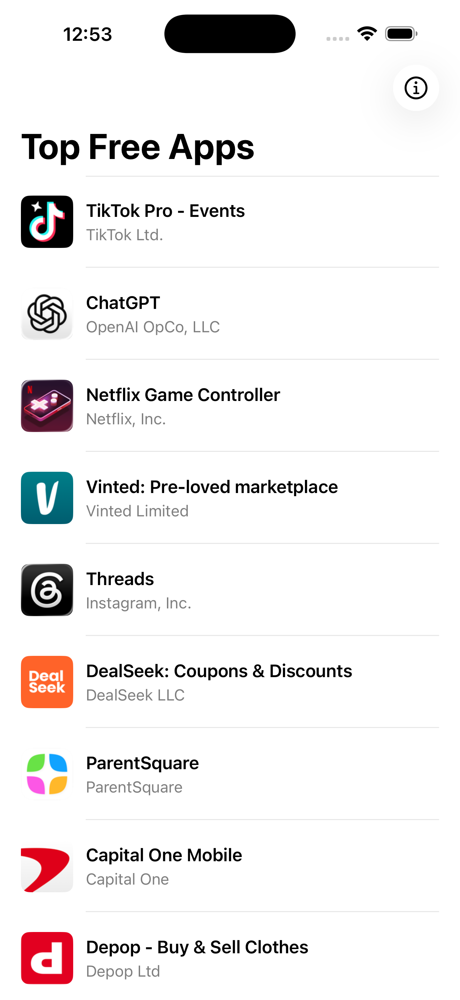
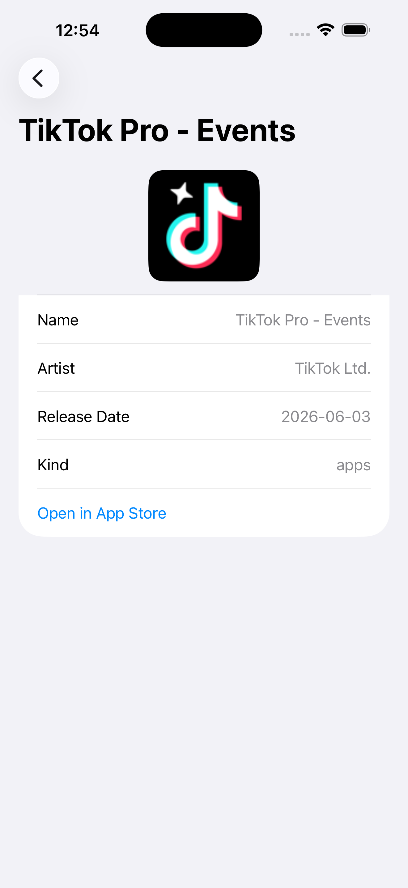
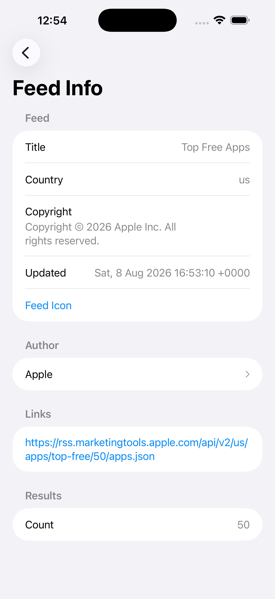

# ResultsArrayTest

A small iOS/SwiftUI project that fetches the Apple RSS feed of top free apps, decodes the JSON response into Swift `Codable` models, and displays a navigable list of apps with full feed metadata.

Originally created as a live-coding exercise, this project has been refactored into a layered, testable architecture using async/await networking, the repository pattern, MVVM, and a navigation coordinator.

## Features

- Fetches the top free apps feed from Apple's RSS endpoint
- Decodes the entire JSON payload, including feed metadata, author, links, and genre objects
- Displays a scrollable list of apps with artwork thumbnails
- Tap any app to see details and its genres
- Tap any genre to drill into a genre detail view
- View feed metadata and author from the toolbar
- Pull-to-refresh and error states with retry
- Unit tests using Swift Testing

## Screenshots

| Feed List | App Detail | Feed Info |
|-----------|------------|-----------|
|  |  |  |

## Architecture

```
ResultsArrayTest/
├── Models/          # Codable models: RSSFeed, Feed, Author, FeedLink, AppResult, Genre
├── Network/         # Endpoint, NetworkError, NetworkServiceProtocol, NetworkService, MockNetworkService
├── Repositories/    # FeedRepositoryProtocol, FeedRepository
├── ViewModels/      # FeedViewModel
├── Navigation/      # AppRoute, NavigationCoordinator
└── Views/           # ContentView, AppRowView, AppDetailView, GenreDetailView, AuthorView, FeedInfoView, StateViews
```

- **Protocol-oriented networking** — `NetworkServiceProtocol` makes the network layer swappable for tests and previews.
- **Repository pattern** — `FeedRepository` isolates data-fetching logic from the view model.
- **MVVM** — `FeedViewModel` owns loading, success, and error states.
- **Navigation coordinator** — `NavigationCoordinator` drives a `NavigationStack` with a typed `AppRoute` enum.

## Requirements

- Xcode 26.3+
- iOS 26.2+
- Swift 5

## Build and run

From the repository root:

```bash
xcodebuild -project ResultsArrayTest.xcodeproj -scheme ResultsArrayTest -destination 'platform=iOS Simulator,name=iPhone 17 Pro' build
```

Run unit tests:

```bash
xcodebuild -project ResultsArrayTest.xcodeproj -scheme ResultsArrayTest -destination 'platform=iOS Simulator,name=iPhone 17 Pro' test
```

> Use any available iOS Simulator. Adjust the `name=` value if `iPhone 17 Pro` is not installed on your Mac.

## Step-by-step process for future live coding tests

1. **Make it compile first.** Fix build errors before adding features.
2. **Model the data correctly.** Inspect the actual JSON and write Codable types that match real shapes.
3. **Get something on screen.** Render the list or main entity as simply as possible.
4. **Add drill-down navigation.** Introduce a route enum and `NavigationStack`.
5. **Introduce architecture layers.** Extract network, repository, and view model.
6. **Write unit tests.** Start with decoding the local fixture; then mock the network boundary.

## First problem to tackle

**Compilation and data-model correctness.** Verify the project builds and the JSON decodes into your models before touching UI, navigation, architecture, or tests. Everything else depends on those two foundations.

## License

This project is an exploratory learning exercise with no external dependencies.
